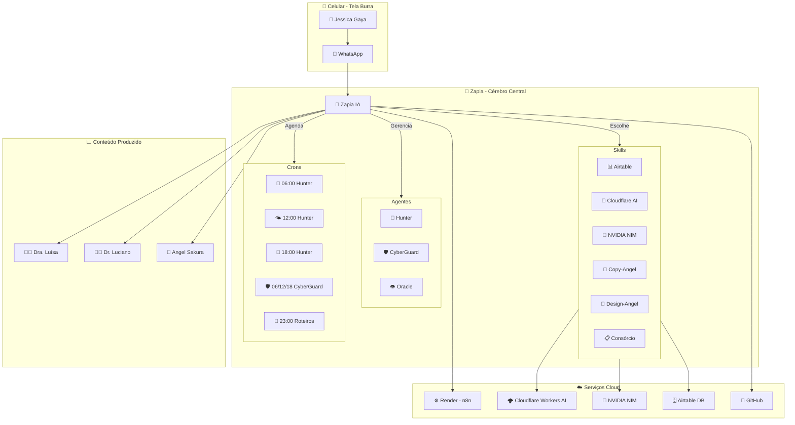
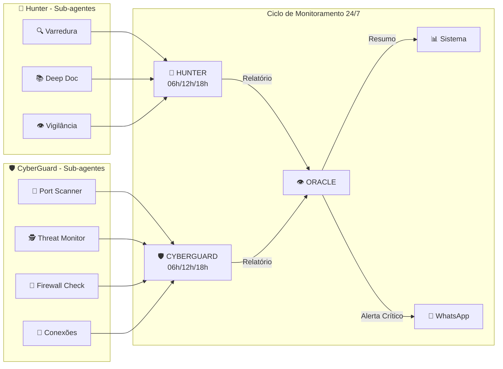
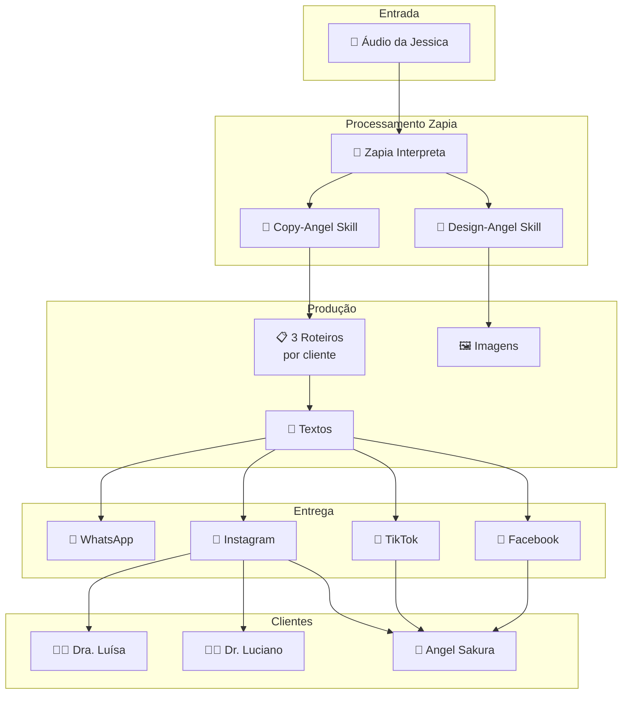
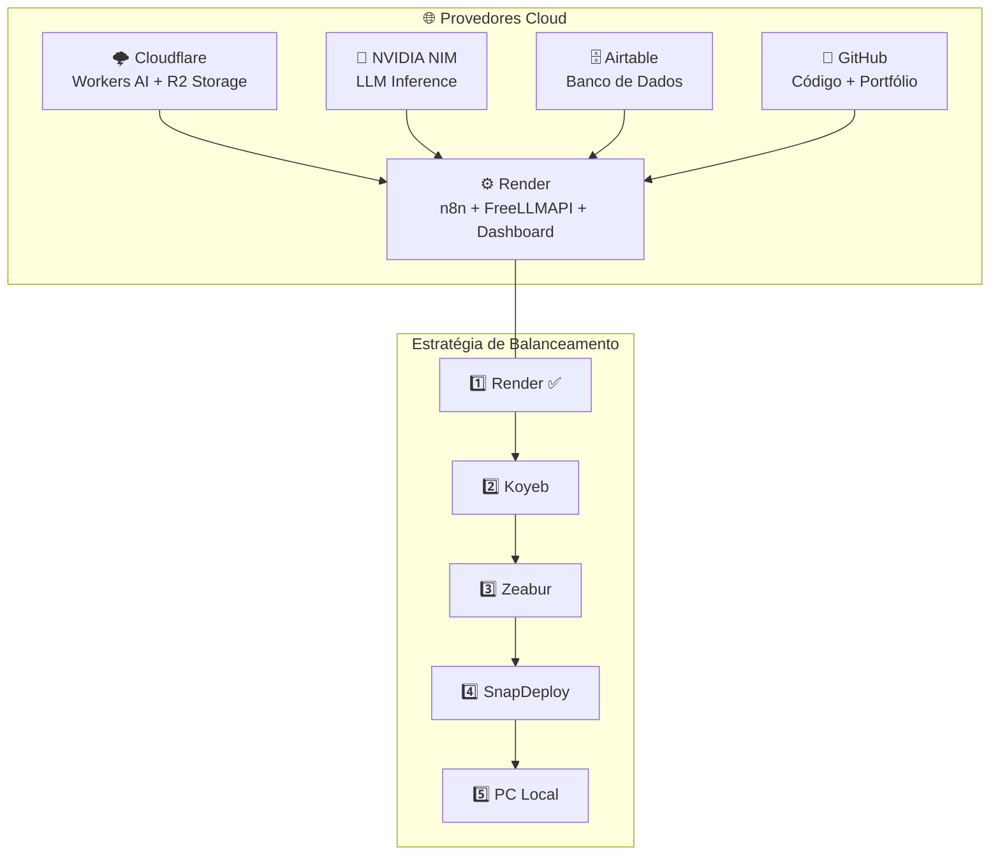

# 🏗️ Diagramas de Arquitetura — Atena Ecosystem

> Diagramas em Mermaid — renderizam automaticamente no GitHub.
> Para visualizar, abra qualquer arquivo `.md` no GitHub que contenha blocos ````mermaid`.

---

## 1. 🌐 Arquitetura Geral do Sistema



---

## 2. 🔄 Fluxo de Agentes e Monitoramento



---

## 3. 🏛️ Fluxo de Conteúdo (Roteiros)



---

## 4. ⚙️ Infraestrutura em Nuvem



---

## 5. 🗓️ Grade de Conteúdo Diária

```mermaid
gantt
    title Grade de Conteúdo - Dra. Luísa
    dateFormat HH:mm
    axisFormat %H:%M
    
    section Stories
    Story Matinal      :s1, 08:00, 1h
    Story 12h          :s2, 12:00, 1h
    Story 18h          :s3, 18:00, 1h
    
    section Reels
    Reel 15h           :r1, 15:00, 1h
    Reel 20:30         :r2, 20:30, 1h
```

```mermaid
gantt
    title Produção de Roteiros (Zapia)
    dateFormat HH:mm
    axisFormat %H:%M
    
    section Geração
    Roteiros Luísa     :g1, 23:00, 2h
    Roteiros Luciano   :g2, 08:00, 2h
    Roteiros Angel S.  :g3, 09:00, 2h
```



