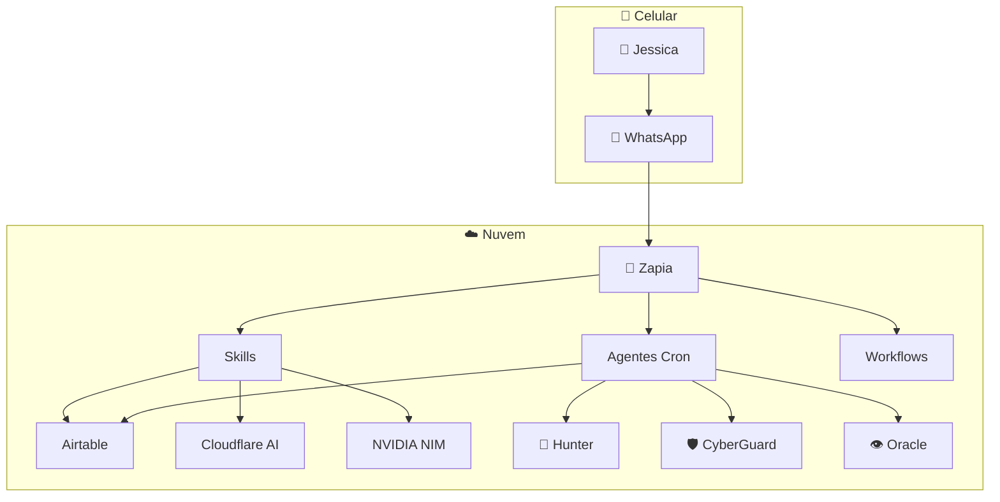

# 🎨 Design System — Atena Ecosystem

> Documento oficial de identidade visual para documentação e diagramas do ecossistema.

---

## 1. 🎯 Paleta de Cores

| Elemento | Cor | Hex | Uso |
|----------|-----|:---:|-----|
| Fundo | Branco | #FFFFFF | Telas, diagramas |
| Texto principal | Preto | #141414 | Títulos, labels |
| Texto secundário | Cinza | #646464 | Legendas, descrições |
| Destaque | Laranja | #FF9900 | Linhas de separação, selo |
| Bloco Core | Azul escuro | #232F3E | Borda do núcleo |
| Vigilância | Roxo | #A066F0 | Hunter, Segurança |
| Dados/Métricas | Verde | #34D399 | Banco de dados, gráficos |
| IA/Criativos | Rosa | #F472B6 | LLMs, geração de imagem |
| Infra | Vermelho | #E86060 | Servidores, deploy |
| Mídia/Vídeo | Azul claro | #60A5FA | Editor de vídeo |

---

## 2. 📐 Estilo de Diagramas

### Regras Visuais

- **Fundo:** BRANCO (#FFFFFF) — limpo, profissional
- **Ícones:** Sempre com círculo ao redor (estilo AWS)
- **Linhas:** Finas, elegantes, discretas
- **Conexões:** Linhas retas com setas simples
- **Direção:** De cima para baixo ou entrada → saída
- **Blocos:** Cantos arredondados, bordas finas

### Template de Box

```
┌──────────────────┐
│  🟣 Nome Serviço │
│  [função]        │
└──────────────────┘
```

### Cores por Categoria

```
🧠 Core (Zapia)      → Azul escuro #232F3E
👻 Hunter/Segurança  → Roxo #A066F0
🎨 Design/Criativo   → Rosa #F472B6
📊 Dados             → Verde #34D399
⚙️ Infra             → Vermelho #E86060
📱 Mídia             → Azul claro #60A5FA
```

---

## 3. 🏷️ Selos de Status

| Status | Selo | Cor |
|--------|------|-----|
| Online | 🟢 | Verde |
| Atenção | 🟡 | Amarelo |
| Offline | 🔴 | Vermelho |
| Em desenvolvimento | 🟠 | Laranja |
| Planejado | ⚪ | Cinza |

---

## 4. 📝 Fontes

- **Títulos:** Montserrat Bold (ou negrito do sistema)
- **Corpo:** Inter / System UI
- **Código:** JetBrains Mono / Fira Code
- **Diagramas:** Monospace para fluxos em ASCII

---

## 5. 🖼️ Exemplos de Diagrama

### Mermaid (para GitHub)



### ASCII (para documentação)

```
╔══════════════════════════════════╗
║         ☁️ NUVEM                 ║
║                                  ║
║  ┌──────────────────────────┐    ║
║  │      🧠 ZAPIA            │    ║
║  └──────────┬───────────────┘    ║
║             │                    ║
║     ┌───────┼───────┐           ║
║     ▼       ▼       ▼           ║
║  Skills  Agentes  Workflows     ║
╚══════════════════════════════════╝
```